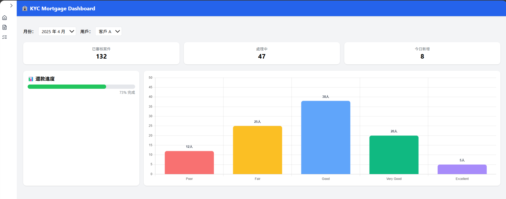
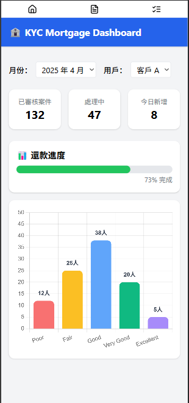

# KYC Mortgage Dashboard

A responsive React + TypeScript dashboard designed to visualize key credit and repayment metrics for mortgage clients. The project simulates real-world data handling using mock APIs, with dynamic visual updates based on selected client and month.

---

## Features

- Dynamic credit score distribution chart (Chart.js)
- Repayment progress bar with mock API data
- Filter by month and user (client)
- Full mock API integration (simulated backend logic)
- Loading states and empty data prompts for smooth UX
- Responsive layout (grid-based for desktop, tablet, and mobile)

---

## Dashboard Structure

- `Dashboard.tsx`: Main layout with dropdown filters, KPI cards, progress bar, and chart
- `CreditScoreChart.tsx`: Chart.js bar chart updated via props
- `ProgressBar.tsx`: Simple visual component showing repayment percent
- `api.ts`: Simulated API with mock data based on `month` and `userId`

---

## Core Use Cases

### 1. Month & User Filters
Select different months and clients to simulate how repayment progress and credit profile vary by case.

### 2. Dynamic Chart Update
The bar chart updates automatically based on selected props (`month`, `userId`), with:
- Five credit levels (Poor to Excellent)
- Dynamic data and labels
- Smart Y-axis scaling based on dataset

### 3. Loading & Fallback UX
- Displays loading message while data is fetching
- Displays empty-state prompt when no data is available

---

## Technologies Used

- React 18 + TypeScript
- Tailwind CSS (UI layout/styling)
- Chart.js with react-chartjs-2
- Vite (build tool)

---

## Interview Highlights

- Demonstrates real-world dashboard behavior with asynchronous data fetching and prop-driven chart updates
- Applies React state lifting and props-based component communication
- Includes loading state and empty data handling to enhance user experience
- Simulates realistic backend responses with parameter-based mock API logic
- Emphasizes clean architecture and reusability for future scalability

---

## Future Enhancements

- Connect to real backend (e.g., FastAPI, Firebase, or Supabase)
- Implement user authentication and role-based access control
- Enable data export to CSV or PDF
- Add historical credit score trend visualization

---

## Project Setup

```bash
git clone https://github.com/yourname/kyc-mortgage-dashboard
cd kyc-mortgage-dashboard
npm install
npm run dev
```

---
## Preview

> Real-time preview: [https://kyc-mortgage-dashboard.vercel.app](https://kyc-mortgage-dashboard.vercel.app)

### 🖥️ Desktop View  


### 📱 Mobile View  

